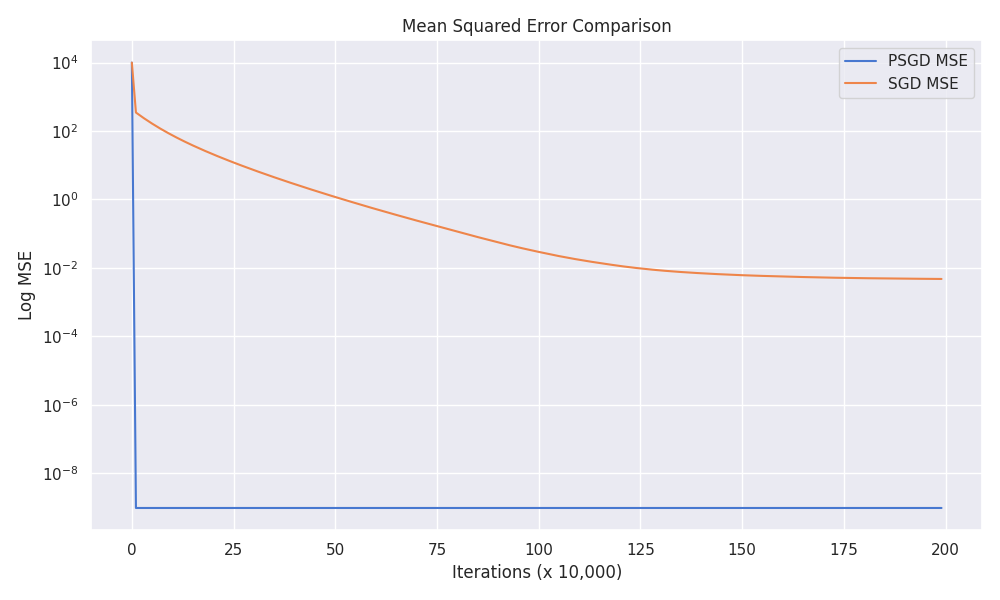

# psgd_linear_models

Consider convergence of psgd vs sgd on liear models for classification and regression tasks

## Linear BinaryClassification 

PSGD performs the same as SGD for isotropic gaussian data

PSGD significantly outperforms SGD for non-isotropic data

## Linear Regression

PSGD performs the same as SGD for isotropic gaussian data

PSGD converges faster than SGD for non-isotropic data and to a much better solution
